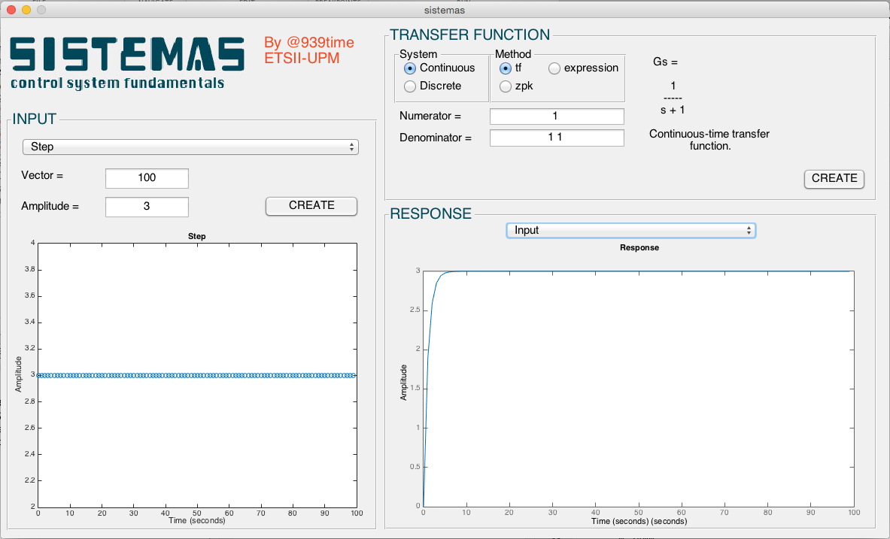

## Synopsis

AppSistemas is an user interface created with Matlab GUI. With this program you can train different concepts related with control system fundamentals such as input signals (impulses, steps or ramps), transfer functions (continuous and discrete systems made with several methods, tf, zpk, etc.) and you can obtain responses of these systems. The GUI is very basic and need a lot of work so be aware of this detail. Help will be very greatful.

## Example

## Motivation

This project helps me understand the Matlab GUI and fundamentals concepts of system control.

## Installation

Clone the project, open Matlab, browse into the AppSistemas folder and double click sistemas.m or type sistemas on the Command Window in Matlab.

## Contributors

The code is not optimazed but I think the program has great potential, feel free to contribute, clone, add, commit, etc. It will help me a lot to learn how to create a profetional project in Matlab.
Sorry for all the tags and variables, they have the default names because when I changed the tags names many erros appeared, so I choose to use the default names.

## License

AppSistemas is available under the MIT license. See the LICENSE file for more info.
